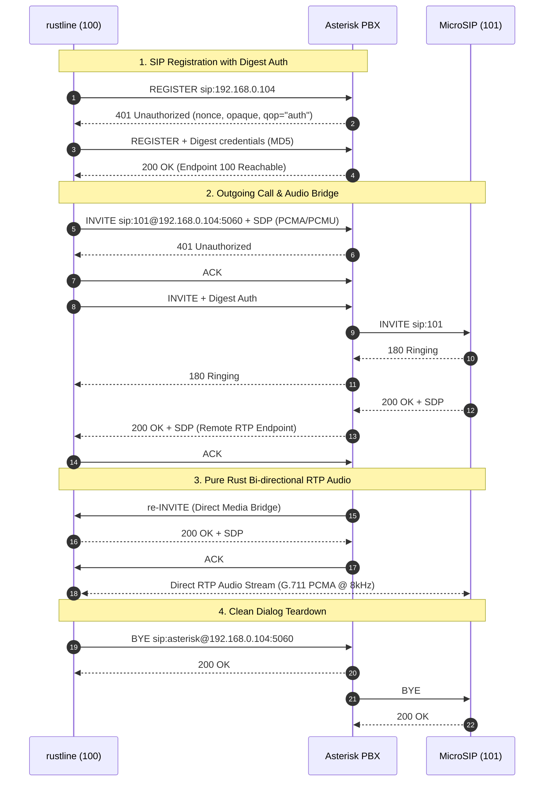

<p align="center">
  <picture>
    <source media="(prefers-color-scheme: dark)" srcset="https://capsule-render.vercel.app/api?type=waving&color=gradient&customColorList=6,11,18,24&height=220&section=header&text=rustline&fontSize=70&fontAlignY=38&desc=Pure%20Rust%202024%20Headless%20VoIP%20%26%20SIP%20Softphone%20Engine&descAlignY=62&descSize=19&fontColor=ffffff">
    
  </picture>
</p>

<p align="center">
  <a href="https://github.com/pochemu-august/rustline/actions"></a>
  <a href="https://github.com/pochemu-august/rustline"></a>
  <a href="https://github.com/pochemu-august/rustline"></a>
  <a href="https://github.com/pochemu-august/rustline/blob/main/LICENSE"></a>
  <a href="https://github.com/pochemu-august/rustline"></a>
</p>

<p align="center">
  <b>A next-generation, cross-platform softphone engine engineered from scratch in Rust 2024.</b><br/>
  <i>Zero C/C++ FFI. Zero PJSIP wrappers. Full memory safety, headless JSON-RPC 2.0 daemon, and pure Rust RTP media streaming.</i>
</p>

---

## ⚡ Highlights

- 🦀 **Pure Safe Rust 2024 (Zero C/C++ FFI):** Built without legacy C wrappers like PJSIP or libortp. True memory safety, safe concurrency, and seamless cross-compilation.
- 🎯 **Headless Client-Server Design:** The core engine runs as a lightweight daemon (`rustline-daemon`) exposing a WebSocket `JSON-RPC 2.0` API at `ws://127.0.0.1:7890`. Connect **any** front-end: React, Electron, Flutter, Slint, Tkinter, or CLI.
- 🎙️ **Full Audio & Media Pipeline:**
  - **RFC 3550 RTP** implementation in pure safe Rust.
  - **ITU-T G.711 PCMA (A-law) & PCMU (μ-law)** codecs with 20ms frame pacing.
  - Native cross-platform audio capture & playback via `cpal` (WASAPI, ALSA, CoreAudio).
  - Symmetric RTP & remote target learning for smooth NAT traversal.
- 🏢 **Production Asterisk PBX Verified:** Battle-tested against real Asterisk 22 PJSIP instances:
  - RFC 2617 MD5 Digest Authentication with `qop="auth"` challenges.
  - Seamless handling of in-dialog re-INVITEs (session timers & direct native media bridging).
  - RFC 3261 compliant Contact URI routing and dialog state machine.
- 💻 **Bundled MicroSIP-Style GUI:** Ready-to-use Python/Tkinter desktop client with numpad, registration management, and real-time call states.

---

## 🏗️ Architecture

```
┌────────────────────────────────────────────────────────┐
│                      Any UI Client                     │
│    (Python Tkinter / React / Electron / Slint / CLI)   │
└───────────────────────────▲────────────────────────────┘
                            │ WebSocket JSON-RPC 2.0
                            │ ws://127.0.0.1:7890
┌───────────────────────────▼────────────────────────────┐
│                    rustline-daemon                     │
│          Tokio Async WebSocket Server & Dispatcher     │
└─────────────┬────────────────────────────┬─────────────┘
              │ Calls                      │ Media Streams
┌─────────────▼─────────────┐┌─────────────▼─────────────┐
│       rustline-core       ││       rustline-media      │
│   • SIP UDP Transport     ││   • RFC 3550 RTP Streaming│
│   • RFC 2617 Digest Auth  ││   • G.711 PCMA / PCMU     │
│   • Dialog State Machine  ││   • Hardware I/O (cpal)   │
│   • SDP Codec Negotiation ││   • Jitter Buffer & Mixer │
└───────────────────────────┘└───────────────────────────┘
```

---

## 🔄 Live SIP & RTP Call Flow

The diagram below illustrates the exact, verified message exchange between **rustline**, an **Asterisk PBX**, and a remote softphone (**MicroSIP**):



---

## 📦 Workspace Crates

| Crate | Purpose | Status |
|---|---|---|
| [`rustline-proto`](crates/rustline-proto) | Serde data models for JSON-RPC 2.0 requests, responses, and events |  |
| [`rustline-core`](crates/rustline-core) | Pure Rust SIP stack, UDP transport, MD5 Digest auth, and dialog engine |  |
| [`rustline-media`](crates/rustline-media) | RFC 3550 RTP streaming, G.711 A-law/μ-law codecs, and `cpal` audio hardware I/O |  |
| [`rustline-daemon`](crates/rustline-daemon) | Tokio WebSocket daemon hosting the headless JSON-RPC service |  |

---

## 🚀 Quick Start

### Prerequisites
- **Rust 1.85+** (Rust 2024 edition)
- **Python 3.9+** (for the bundled GUI) with `websockets`:
  ```bash
  pip install websockets
  ```

### 1. Run the Headless Daemon
```powershell
# Run with full debug logging for SIP and Media
$env:RUST_LOG="info,rustline_core=debug,rustline_daemon=debug,rustline_media=debug"
cargo run -p rustline-daemon
```

*Daemon output:*
```text
2026-09-29T18:43:53Z  INFO rustline_daemon: rustline-daemon v0.1.0
2026-09-29T18:43:53Z  INFO rustline_daemon: Media subsystem available: true
2026-09-29T18:43:53Z  INFO rustline_daemon: WebSocket server listening on ws://127.0.0.1:7890
```

### 2. Launch the GUI
```powershell
python rustline-gui/gui.py
```
- Navigate to the **"Аккаунт" (Account)** tab, enter your SIP server credentials, and click **Регистрация (Register)**.
- Dial an extension on the keypad (e.g. `101`) and press **Вызов (Call)**.
- Full two-way voice streaming engages immediately!

---

## 🔌 WebSocket JSON-RPC 2.0 API

Clients communicate with the daemon over WebSocket at `ws://127.0.0.1:7890`.

### Methods
- `register` — Register line on PBX (`server`, `username`, `password`, optional `port`, `domain`).
- `unregister` — Gracefully unregister from the PBX.
- `dial` — Place an outbound call (`target` extension or SIP URI).
- `answer` — Answer an incoming call (`call_id`).
- `hangup` — Terminate an active call (`call_id`).
- `hold` — Toggle call hold.
- `dtmf` — Send DTMF tone digits.

### Example Request
```json
{
  "jsonrpc": "2.0",
  "id": 1,
  "method": "dial",
  "params": {
    "target": "101"
  }
}
```

### Server Events (Broadcast)
- `registration_state_changed` (`unregistered` | `registering` | `registered` | `failed`)
- `incoming_call` (`call_id`, `caller_uri`, `caller_name`)
- `call_state_changed` (`incoming` | `early` | `confirmed` | `disconnected`)

---

## 🗺️ Roadmap

- [x] **Milestone 1: SIP Signaling Engine**
  - [x] Headless Architecture with WebSocket JSON-RPC 2.0
  - [x] Pure Rust SIP UDP transport (`rsip`)
  - [x] RFC 2617 MD5 Digest Authentication
  - [x] PBX Registration (`REGISTER`, `401`, `200 OK`)
  - [x] Full Call Handshake (`INVITE`, `180 Ringing`, `200 OK`, `ACK`, `BYE`)
  - [x] In-dialog re-INVITE handling for session timers & direct RTP bridging
  - [x] Contact URI routing for RFC 3261 compliance
- [x] **Milestone 2: Media Subsystem & Audio**
  - [x] RFC 3550 RTP Packet encoder & decoder
  - [x] ITU-T G.711 PCMA / PCMU pure Rust codecs
  - [x] Asynchronous RTP UDP socket engine with 20ms pacing
  - [x] Symmetric RTP & NAT target adaptation
  - [x] CPAL audio hardware integration (microphone capture & speaker playback)
- [ ] **Milestone 3: Advanced Voice Features**
  - [ ] RFC 2833 / 4733 Out-of-band DTMF transmission
  - [ ] Call Hold / Unhold (`a=sendonly` re-INVITEs)
  - [ ] Adaptive Jitter Buffer
  - [ ] Opus wideband codec integration
- [ ] **Milestone 4: Native GUI & Packaging**
  - [ ] Slint / Tauri native cross-platform GUI
  - [ ] Windows / macOS / Linux installation packages

---

## 🛡️ License

This project is licensed under the [GNU General Public License v3.0](LICENSE).
Feel free to contribute, open issues, or submit pull requests!
